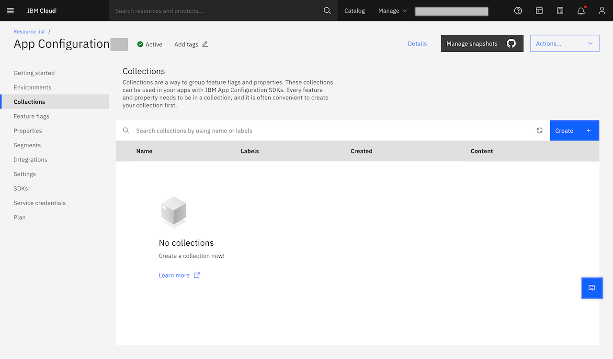
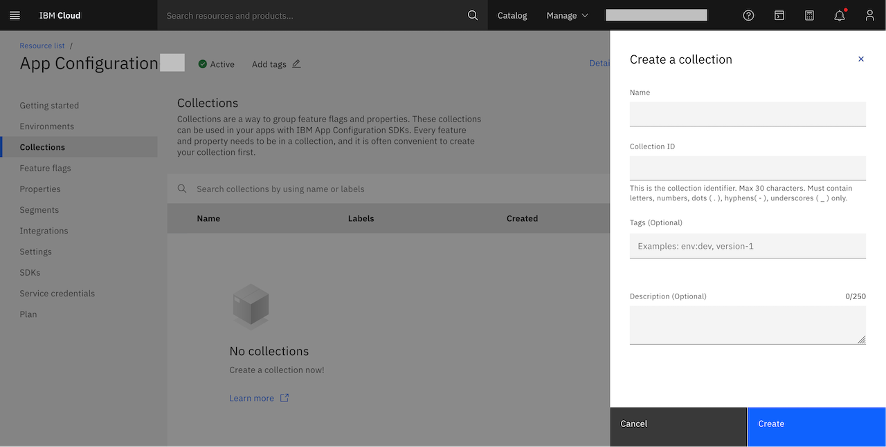
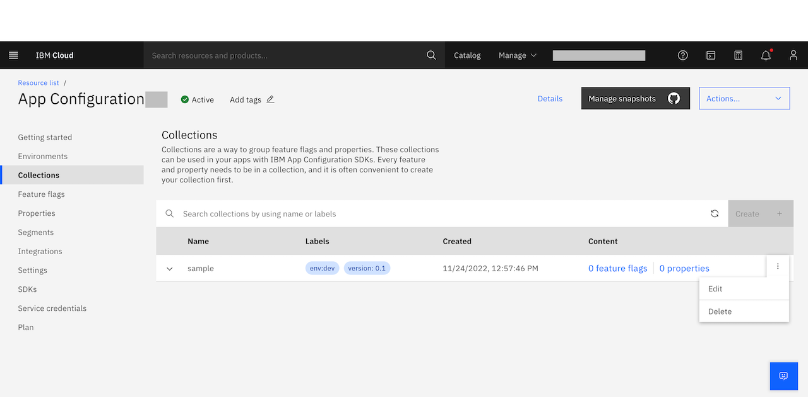

---

copyright:
  years: 2020, 2022
lastupdated: "2022-10-11"

keywords: app-configuration, app configuration, create a collection, collections, properties, property

subcollection: app-configuration

---

{{site.data.keyword.attribute-definition-list}}

# Collections
{: #ac-collections}

Collections are a way to group feature flags and properties. These collections can be consumed in your apps with the help of a collection ID and {{site.data.keyword.appconfig_short}} SDKs. Every feature must be in a collection, so create your collection first.
{: shortdesc}

By default, **Collections** displays the list of collections in the current {{site.data.keyword.appconfig_short}} service instance along with **Name**, the **Labels** associated, the date of creation of the collection, and the collection **Content** (number of feature flags and number of properties).
{: note}

## Create a collection
{: #ac-create-a-collection}

To create a collection, complete these steps:

1. From the {{site.data.keyword.appconfig_short}} console, click **Collections** from the navigation menu or from **Getting Started** > **Create a collection**.

   {: caption="List of collections in the current {{site.data.keyword.appconfig_short}} service instance." caption-side="bottom"}

1. Click **Create**. The side panel opens with fields for creating a new collection.

   {: caption="{{site.data.keyword.appconfig_short}} service creating a new collection" caption-side="bottom"}

1. Provide the collection details:
   - **Name** - name of the collection.
   - **Collection ID** - the collection identifier, the value is auto suggested based on the entered collection name. You can modify the same, if needed. Use the **Collection ID** value as the identifier in your SDK or API code.
   - **Tags** - specify the tags that need to be associated with the collection, which is optional.
   - **Description** - add a description of the collection, which is optional.

1. Click **Create**.

## Collection - overflow menu
{: #collection-overflow-menu}

The overflow menu for each of the collection (three vertical dots) consists of **Edit**, **View features**, and **Delete** operations.

{: caption="Overflow menu for a collection" caption-side="bottom"}

- When **Edit** option is selected, you can change the values for **Name**, **Tags**, and **Description** fields.
- When **Delete** option is selected, a confirmation window is displayed to seek confirmation to delete the selected collection. Delete option permanently deletes the collection, this action cannot be undone.

To copy the **Collection ID** to the clipboard, expand the collection name by clicking collapse arrow next to the required **Collection ID** and click the **Copy to clipboard** icon. Use this value as the identifier in your SDK or API code.
{: note}
