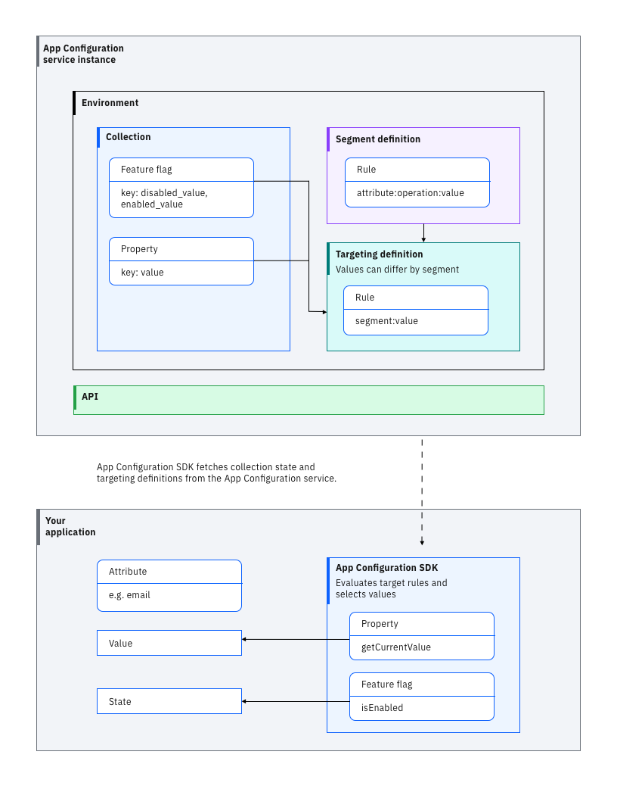

---

copyright:
  years: 2020, 2021
lastupdated: "2021-03-29"

keywords: app-configuration, app configuration, about app configuration

subcollection: app-configuration

---

{:codeblock: .codeblock}
{:external: target="_blank" .external}
{:important: .important}
{:note: .note}
{:pre: .pre}
{:screen: .screen}
{:shortdesc: .shortdesc}
{:tip: .tip}

# {{site.data.keyword.appconfig_short}} concepts
{: #ac-overview}

{: caption="Figure 1. App configuration overview" caption-side="bottom"}

## Service instance 
{: #ac-service-instance}
An {{site.data.keyword.appconfig_short}} service instance is your copy of the {{site.data.keyword.appconfig_short}} application on the {{site.data.keyword.Bluemix_notm}}. You create an instance from the tile in the {{site.data.keyword.Bluemix_notm}} catalog. Now you have access to the {{site.data.keyword.appconfig_short}} dashboard and all the functionality that comes with the selected pricing plan.

## Environment
{: #ac-environment}
{{site.data.keyword.appconfig_short}} environments are sets of configuration values that are applied to the environments you run and manage in your infrastructure. For example, your software development process might involve three environments: development, staging, and production. Configuration values for all three can be present in a single instance of {{site.data.keyword.appconfig_short}}. All configuration keys (names) automatically replicate across all environments inside {{site.data.keyword.appconfig_short}}, but the values for each key are specific to each environment.

## Collection 
{: #ac-collectiondef}
Use collections to group feature flags and properties in any way that is meaningful to you. Often a collection is used to represent all configuration values for a particular application. Feature flags and properties can belong to more than one collection for cases where you want to share a common configuration value across apps or sets of infrastructure.

## Feature Flag
{: #ac-fefl}
Feature flags are configuration parameters that you want to switch on and off quickly or frequently. They can be used to set the state of your application. Within your application, the `isEnabled()` method of the {{site.data.keyword.appconfig_short}} SDK is used to activate conditional blocks of code to turn features on and off based on the state of a feature flag. Use feature flags to dark launch features into production and then switch them on only for selected users (usually testers or quality assurance personnel) or roll them out to your users selectively and independent from deployments. Each feature flag must belong to a collection.

## Property
{: #ac-propertydef}
Properties are configuration parameters that don't change often, but that still need centralized management. Consolidate properties for all your app and environment components into one central cloud dashboard, with {{site.data.keyword.appconfig_short}}, thus avoiding the hassle of managing multiple parameter files. Within your application, the `getCurrentValue()` method of the {{site.data.keyword.appconfig_short}} SDK is used to access the current value of a property. Each property must belong to a collection.

## Segment definition
{: #ac-segmentdef}
Using {{site.data.keyword.appconfig_short}}, a single feature flag, or property, can have many values, with each value applied to a specific group of entities (users, devices, infrastructure components). Each group is called a segment. Members of a segment share one or more common attributes as defined by a set of segment rules. Segments are optional.

## Attribute
{: #ac-attribute}
An attribute is a parameter that is used to define a segment. Attributes are used to create segment rules on the {{site.data.keyword.appconfig_short}} dashboard, but names of the attributes and values of each attribute are defined in your code. At run time, the {{site.data.keyword.appconfig_short}} SDK fetches the segment rules into your application instance and determine whether it is a part of the segment.

## Targeting definition  
{: #ac-targetdef}
Feature flags and properties are targeted to segments based on a set of rules that are called the targeting definition. With targeting, you can override the default value for a flag or property, for any segment you have defined. 

## {{site.data.keyword.appconfig_short}} SDK 
{: #ac-SDK-concept}
The {{site.data.keyword.appconfig_short}} SDK handles the automatic delivery of the appropriate flag state or property value into your application. It connects to the endpoints provided by the {{site.data.keyword.appconfig_short}} API, fetches collections, and evaluates segment and targeting rules. Server-side SDKs connect to the {{site.data.keyword.appconfig_short}} service through a websocket for real-time updates. Client-side SDKs pull values from the {{site.data.keyword.appconfig_short}} service upon a lifecycle change such being opened or brought to the foreground.  SDKs are available in various client-side and serve-side languages, and more languages are being added all the time.
