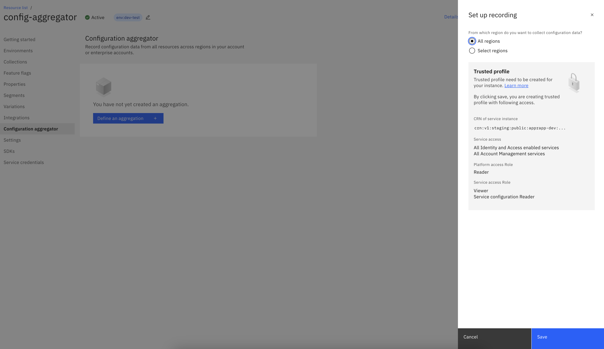
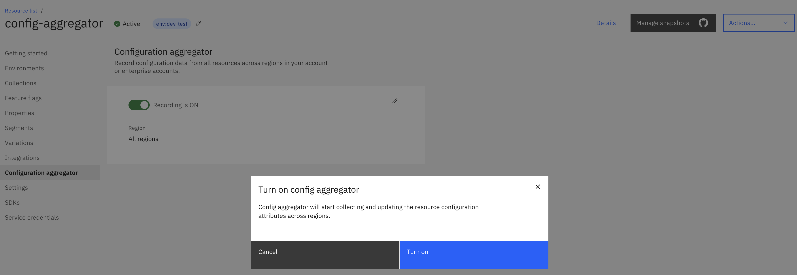
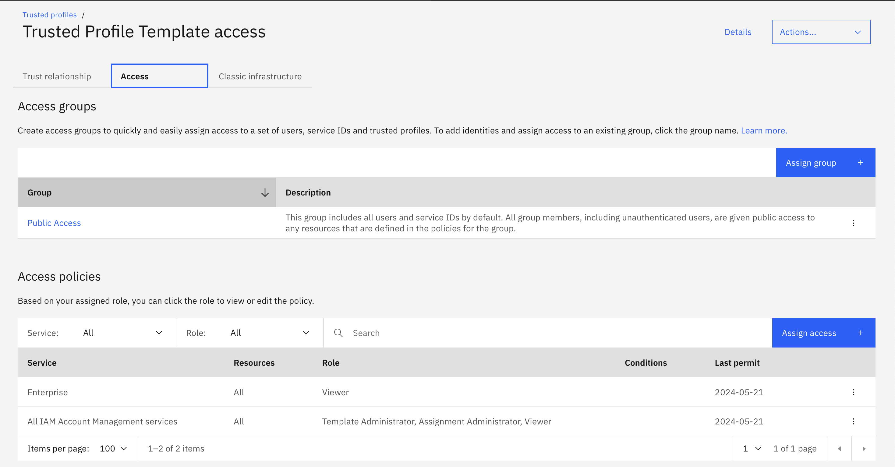
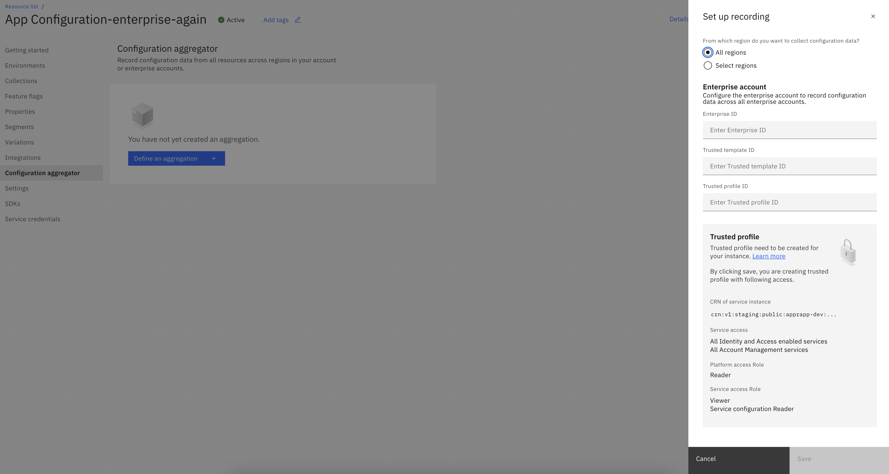
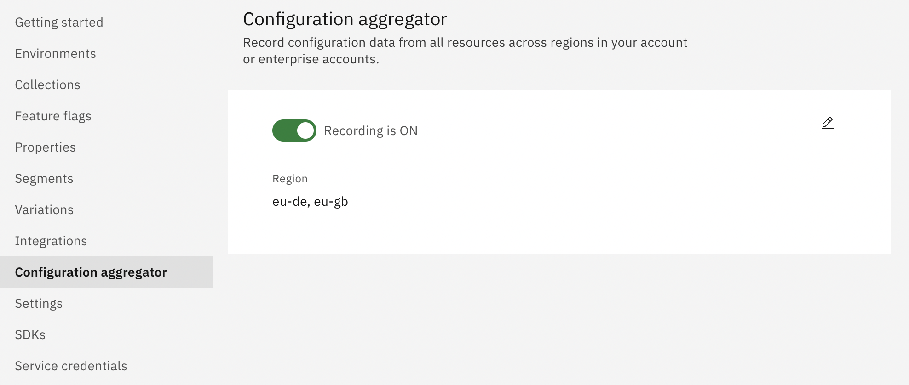

---

copyright:
  years: 2020, 2024
lastupdated: "2024-08-13"

keywords: app-configuration, app configuration, enable configuration aggregation

subcollection: app-configuration

---

{{site.data.keyword.attribute-definition-list}}

# Configuration Aggregator
{: #ac-configuration-aggregator}

User creates an instance of {{site.data.keyword.appconfig_short}} service. All the plans of the {{site.data.keyword.appconfig_short}} service will have the Configuration Aggregator feature available. As an app owner, the user has to explicitly enable the Configuration Aggregator. It can be done on the {{site.data.keyword.appconfig_short}} instance either via API, SDK or Dashboard. The {{site.data.keyword.appconfig_short}} service will start the resource collection and periodically to keep the metadata current via reconciliation. User can use the query API to get the updated metadata of the service instances in the account. It can be used to collect resource metadata at an Enterprise level as well.

Configuration Aggregator feature can be configured on an {{site.data.keyword.appconfig_short}} instance at Enterprise account level to collect resource metadata from all the sub-accounts of the enterprise.

A trusted profile template should be created providing access to {{site.data.keyword.appconfig_short}} service instance to all the IAM enabled services. The trusted profile template should then be assigned to the required accounts in the Enterprise. This creates the template assignments that creates the trusted profile in the respective accounts.

The trusted profile template cannot be assigned to the enterprise account i.e the top level account of the enterprise. If you choose to collect metadata of resources in the enterprise account, you should create a separate trusted profile that should be applied at the top level account additionally.

By default, recording is always set to be OFF.
{: shortdesc}

{: caption="Figure 1. Default Configuration Aggregator" caption-side="bottom"}

## Enable Configuration aggregator - Single Account
{: #ac-enable-configuration-aggregator-single-account}

To enable configuration aggregator, complete these steps:

1. In the {{site.data.keyword.appconfig_short}} console, click **Configuration aggregator**.

1. Click on **Define an aggregation**. The side panel opens with fields for setting up recording details.

   {: caption="Figure 2. Set up recording - Single Account" caption-side="bottom"}

1. Select either **all regions** or specific regions from the **region** list. Click on **Save** to complete.

1. Click on toggle button to enable recording. It will ask for confirmation. Click on **Turn on** button.

   {: caption="Figure 3. Enable Recording - Single Account" caption-side="bottom"}

## Enable Configuration aggregator - Enterprise Account
{: #ac-enable-configuration-aggregator-enterprise-account}

**Pre-requisities**

1. Create an {{site.data.keyword.appconfig_short}} instance at the top-level of the enterprise i.e enteprise account.

1. Create a Trusted Profile Template providing access for the {{site.data.keyword.appconfig_short}} service instance to the IAM enabled services and Account Management services. Refer [here](/docs/secure-enterprise?topic=secure-enterprise-tp-template-create&interface=api)

   {: caption="Figure 4. Trusted Profile Template - Enterprise Account" caption-side="bottom"}

1. Assign the Trusted profile template to the required accounts and account groups in the Enterprise.

**NOTE** The Enterprise IAM should be enabled in the sub-accounts of an Enterprise to be managed via Enteprise. Ensure that this option is enabled. For more details, refer [here](/docs/secure-enterprise?topic=secure-enterprise-enterprise-managed-opt-in&interface=api#existing-acct-opt-in-api)

To enable configuration aggregator for an enterprise account, complete above pre-requisites and following steps:

1. In the {{site.data.keyword.appconfig_short}} console, click **Configuration aggregator**.

1. Click on **Define an aggregation**. The side panel opens with fields for setting up recording details.

   {: caption="Figure 2. Set up recording - Enterprise Account" caption-side="bottom"}

1. Provide the Set up record details:
   - **Region** - regions from which user wants to collect configuration data.
   - **Enterprise ID** - enterprise account id.
   - **Trusted template ID** - trusted profile template id created as pre-requisite.
   - **Trusted profile ID** - trusted profile id created as pre-requisite.

1. Click **Save**.

1. Click on toggle button to enable recording. It will ask for confirmation. Click on **Turn on** button.

   {: caption="Figure 3. Enable Recording - Enterprise Account" caption-side="bottom"}
