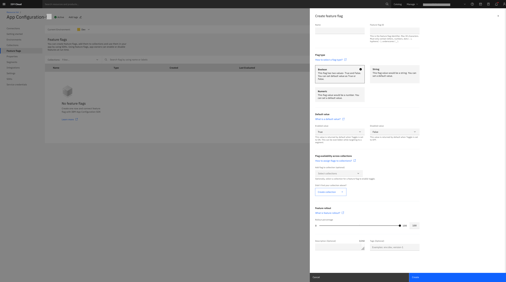
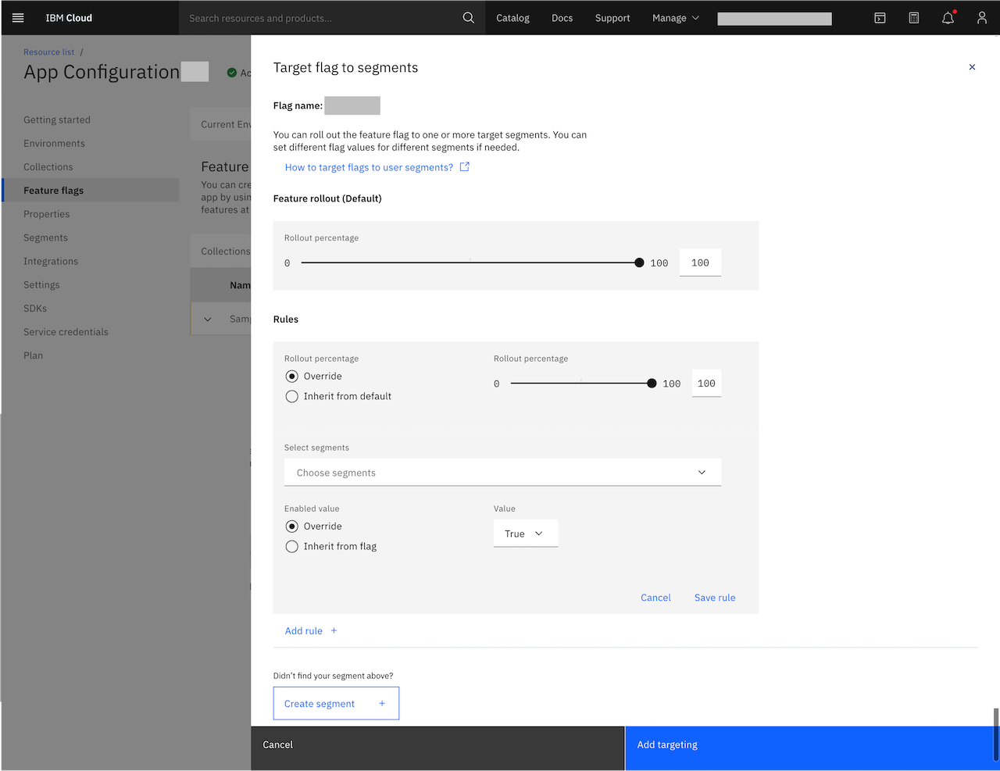
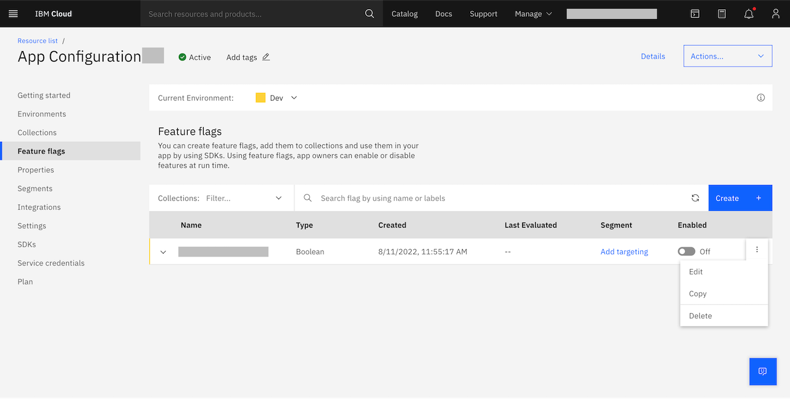

---

copyright:
  years: 2020, 2023
lastupdated: "2023-05-12"

keywords: app-configuration, app configuration, create a feature flag, feature flags

subcollection: app-configuration

---

{{site.data.keyword.attribute-definition-list}}

# Feature flags
{: #ac-feature-flags}

As an app owner, create, and manage feature flags, add them to collections and use them in your app by using SDKs. You can also control the applicability of a feature by enabling or disabling it at run time.
{: shortdesc}

You can add an approval process flow for any configuration changes initiated through an {{site.data.keyword.appconfig_short}} environment by using the ServiceNow integration. The approval process flow is applicable to an {{site.data.keyword.appconfig_short}} environment like dev, stage, and production. For more information, see [Manage workflow](/docs/app-configuration?topic=app-configuration-ac-manage-workflow).

A feature can be enabled or disabled to all the collection users or to a specific set of users and devices or to a certain percentage of specific set of users and devices.

Feature roll outs can be coordinated by defining a start and end time and date. Also, choose a specific day on which a defined feature can be enabled or disabled.

By default, the **Feature flags** page displays the list of feature flags that are created in the current environment of the {{site.data.keyword.appconfig_short}} service instance along with details of the record. Flag types are categorized as Boolean, Numeric, or String.

- A **Boolean** flag has two values and you can set the default value as 'true' or 'false'.
- A **String** type flag supports data in the form of text, and JSON or YAML files.
- A **Numeric** flag supports integers.

{: caption="Figure 1. List of feature flags" caption-side="bottom"}

## Create a feature flag
{: #ac-create-feature-flag}

To create a feature flag, complete these steps:

1. In the {{site.data.keyword.appconfig_short}} console, click **Features flags**.

1. Select the **Current Environment** to display the list of feature flags in that environment.

1. Click **Create**. The side panel opens with fields for creating a new feature flag.

   {: caption="Figure 2. Creating a new feature flag" caption-side="bottom"}

1. Provide the feature flag details:
   - **Name** - name of the feature flag.
   - **Feature flag ID** - the feature flag ID value is auto suggested based on the entered feature name. You can modify the same, if needed. Use the **Feature flag ID** value as the identifier in your SDK or API code.
   - **Flag type** - specify the type of the feature flag. Supported type includes: Boolean, String, and Numeric. For more information about flag type and default values, see [Selecting feature flag type](#selecting-feature-flag-type).
   - **Default value** - specify the default value for the feature flag type selected. For more information about flag type and default values, see [Selecting feature flag type](#selecting-feature-flag-type).
   - Optionally, select a collection for applying a feature flag now. Otherwise, you need to add a collection before you toggle a feature flag. You can add the feature flag to one or more collections by selecting in the **Flag availability across collections** list.
   - **Feature rollout** - specify the `Rollout percentage` by using the slider. For more information about percentage rollout, see [Configure feature rollout percentage](#configure-rollout-percentage).
   - **Description** - add a description of the feature flag, which is optional.
   - Optionally, define **Tags** that help you to identify the feature flag.

1. Click **Create**.

By default, when you create a new feature flag, the **Enabled** toggle switch is set to `OFF`.
{: note}

## Selecting feature flag type
{: #selecting-feature-flag-type}

You can have one of the following flag types that is associated to a feature flag:
- Boolean
- String
- Numeric

Each of the Flag type is having a default value.
{: #flag-type-default-value}

- When you set the toggle switch to *ON*, the value for the **Enabled value** is required, which can be overridden when targeting to a segment.
- When you set the toggle switch to *OFF*, the value for the **Disabled value** is required, which can be overridden when targeting to a segment.

### Boolean
{: #feature-flag-type-boolean}

When you select the **Flag type** as *Boolean*, the **Default value** details are displayed:

{: caption="Figure 3. Feature flag type - Boolean" caption-side="bottom"}

1. Select the **Enabled value** from the list. This value is returned by default when the toggle switch is set to *ON* for the feature flag. This value can be overridden when targeting to a segment.

1. Select the **Disabled value** from the list. This value is returned by default when toggle switch is set to *OFF* for the feature flag.

### String
{: #feature-flag-type-string}

When you select the **Flag type** as *String*, the **Default value** details are displayed:

{: caption="Figure 4. Feature flag type - String" caption-side="bottom"}

1. Select the **Format** of the string flag type from the list. Supported format is Text, JSON, and YAML. When JSON or YAML format is selected, provide the **Enabled value** and **Disabled value** in the selected format.

1. Specify the **Enabled value**. This value is returned by default when toggle switch is set to *ON* for the feature flag. This value can be overridden when targeting to a segment.

1. Specify the **Disabled value**. This value is returned by default when toggle switch is set to *OFF* for the feature flag.

### Numeric
{: #feature-flag-type-numeric}

When you select the **Flag type** as *Numeric*, the **Default value** details are displayed:

{: caption="Figure 5. Feature flag type - Numeric" caption-side="bottom"}

1. Select the **Enabled value** from the list. Only integer values are supported. This value is returned by default when toggle switch is set to *ON* for the feature flag. This value can be overridden when targeting to a segment.

1. Select the **Disabled value** from the list. Only integer values are supported. This value is returned by default when toggle switch is set to *OFF* for the feature flag.

## Target collections to feature flags
{: #collection-target-feature-flags}

Optionally, select a collection for applying a feature flag now. Otherwise, you need to add a collection before you toggle a feature flag.
You can add feature flags to one or more collections either during creation of feature flag or during editing feature flag details.

For adding collections to the feature flag, for the **Flag availability across collections** field, select the collection from the list.

If you try to target a feature flag that is not linked to a collection, a window is displayed to add a feature flag to a collection.
{: note}

## Configure feature rollout percentage
{: #configure-rollout-percentage}

You can configure the feature flag with a rollout percentage in the range of 0 to 100, denoting the applicability of the feature to a partial set of users or devices.

Percentage rollout helps to enable a feature to a small percentage of random users or subset of entities, providing more control on the release cycle and achieve progressive delivery. When you are confident on the feature that you want to roll out is working as intended, increase the percentage over time.

Percentage rollout uses a hashing algorithm that generates a hash based on the rule set. This hash is used by the SDK to generate a percentage value for that user. The percentage value generated for that user is compared to the value set for the percentage rollout value, determines whether the user is eligible to receive that feature or not.

For example, the hash has partitions from 1 to 100,000. When you assign a feature flag, the hash assigns values from 1 to 100,000 to users in each partition. For example, when you assign 25% to a feature flag, {{site.data.keyword.appconfig_short}} SDK delivers that feature to hash partitions from 1 to 25,000. If you change the percentage of users receiving that feature from 25% to 50%, partitions 25,001 to 50,000 would be added to the set of partitions already receiving that feature.

Percentage rollout capability is available for Lite and Enterprise plans.
{: note}

Following are some of the percentage rollout scenarios:

- If the feature flag is disabled, then SDK returns the default **Disabled value**.
- If the feature flag is enabled without any segment rules and no percentage rollout is set, then the SDK returns default **Enabled value**.
- If the feature flag is enabled without any segment rule and percentage rollout is set to 0%, then the SDK returns **Disabled value** for all users.
- If the feature flag is enabled without any segment rule and percentage rollout is set to a percent, say 50%, then the SDK checks if the user belongs to the configured percentage rollout size, if the user belongs to the rollout criteria, then the SDK returns the **Enabled value**. If the user doesn't belong to the rollout criteria, then the SDK returns the **Disabled value**.
- If the feature flag is enabled with segment rules, then SDK first evaluates the user against the configured rules. If user is part of the configured rule, then the SDK evaluates if the user is eligible for percentage rollout.
   - If multiple rules are configured and the user is checked for rule match until the first match. If no match found, then the SDK evaluates against the default rollout.
   - If the user is evaluated to be part of the segment and the segment percentage rollout is 0%, then even if the user is part of the segment, user will not receive the segment value. The SDK returns the default **Disabled value**.
   - If the user is evaluated to be part of the segment and the segment percentage rollout is set to a percentage, say 50%, then the SDK checks if the user belongs to configured rollout size, if the user belongs to the rollout criteria, then the SDK returns the segment overriding value. If the user doesn't belongs to the rollout criteria, then the SDK returns **Disabled value**.

### View as table
{: #feature-flags-percentage-rollout-scenarios}
{: notoc}

| Feature Flag | Is targeting configured? | Percentage  \n rollout | Is user  \n part of  \n configured segment | Is user  \n part of  \n percentage rollout \n criteria | Value  \n returned  \n by SDK |
| :---------- | :---------- | :---------- | :---------- | :---------- | :---------- |
| Disabled | NA | Any % rollout set | NA | NA | Disabled value |
| Enabled  | No | 0% | NA | No | Disabled value |
| Enabled  | Yes | 0% | Yes | No | Disabled value |
| Enabled  | Yes | 0% | No | No | Disabled value |
| Enabled  | No | Between 0% to 100% | NA | Yes | Enabled value |
| Enabled  | No | Between 0% to 100% | NA | No | Disabled value |
| Enabled  | Yes | Betweeen 0% to 100% | Yes | Yes | Overriden value |
| Enabled  | Yes | Betweeen 0% to 100% | Yes | No | Disabled value |
| Enabled  | Yes | Between 0% to 100% | No | Yes | Enabled value |
| Enabled  | Yes | Between 0% to 100% | No | No | Disabled value |
| Enabled  | No | 100% | NA | Yes | Enabled value |
| Enabled  | Yes | 100% | Yes | Yes | Overriden value |
| Enabled  | Yes | 100% | No | Yes | Enabled value |
{: caption="Table 1. Percentage rollout scenarios" caption-side="bottom"}

## Targeting a segment with a feature flag
{: #targeting-segment-with-feature-flag}

You can roll out feature flags to one or more target segments. You can set different flag values for different segments, if needed.

1. From the {{site.data.keyword.appconfig_short}} console, go to **Feature flags**. This pane displays the list of feature flags available in the current environment of the {{site.data.keyword.appconfig_short}} service instance.

1. Click **Add targeting** in the required feature flag row to display the **Target flag to segments** side-panel.

   {: caption="Figure 6. Target feature flag to segments" caption-side="bottom"}

1. The **Feature rollout** displays the default **Rollout percentage** slider define when creating the feature flag. Modify the rollout percentage value, if required.

1. In the **Rules** section, define the rule by specifying the following:

   - In the **Rollout percentage**, you can define the value as an **Override** or **Inherit from default**. If the **Override** option is selected, then specify the **Rollout percentage** override value by using the slider.
   - Select **Segments** from the list. If no segments are available to target, click **Create segment**. For more information about creating a segment, see [Create a segment](/docs/app-configuration?topic=app-configuration-ac-segments#ac-create-segment).
   - For the **Enabled value**, you can select **Override** and modify the value or select **Inherit from flag**.
   - Click to **Save rule**

   You can define more rules by clicking **Add rule**.

1. Click **Add targeting**.

If you try to target a feature flag that is not linked to a collection, a window is displayed to add a feature flag to a collection.
{: note}

## Enabling a feature flag
{: #enabling-feature-flag}

After you target a feature flag to a segment, click the toggle (ON/OFF) to enable or disable a feature flag.

## Feature flags - overflow menu
{: #feature-flags-overflow-menu}

The overflow menu for each of the feature flag (three vertical dots) consists of **Edit**, **Copy**, and **Delete** operations and **Remove targeting** for those feature flags that are already targeted.

{: caption="Figure 7. Overflow menu for a feature flag" caption-side="bottom"}

- When **Edit** option is selected, you can change the **Name**, **Description**, add or delete **Tags**, change the **Flag type** and **Default value**, and add or remove collections for the **Flag availability across collections** field information.
- When **Copy** option is selected, the feature flag information is copied, and you need to modify the **Name** of the feature flag. Optionally, modify the other details based on your need.
- When **Delete** option is selected, a confirmation window is displayed to seek confirmation to delete the selected feature flag. Deleting option permanently deletes the feature flag and the action cannot be undone.
- In the list of feature flags, in a feature flag, when **Copy to clipboard** icon is clicked, the feature flag's **Feature flag ID** value is copied to the clipboard.
- **Remove targeting** removes the targeting of feature flags to a segment.
