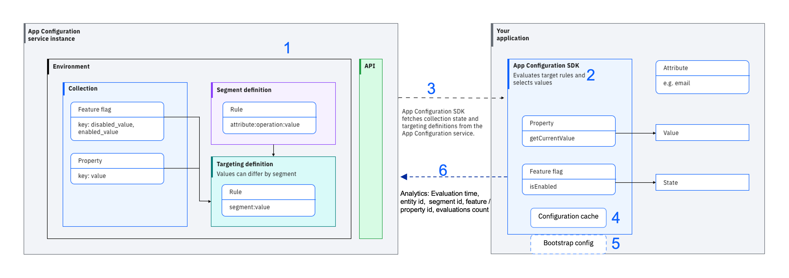

---

copyright:
  years: 2020, 2022
lastupdated: "2022-05-25"

keywords: app-configuration, app configuration, about app configuration

subcollection: app-configuration

---

{{site.data.keyword.attribute-definition-list}}

# How Does {{site.data.keyword.appconfig_short}} Work?
{: #{{site.data.keyword.appconfig_notm}}-how-it-works}

## Normal operation
{: #{{site.data.keyword.appconfig_notm}}-normal-operation}

During normal operation, the {{site.data.keyword.appconfig_short}} SDK (#2 in Figure 1) handles the automatic delivery of the appropriate flag state or property value into your application from the {{site.data.keyword.appconfig_notm}} instance (#1 in the diagram above). During intialization, the SDK connects to the {{site.data.keyword.appconfig_short}} API and fetches the specified collections, segment rules, and targeting rules (#3 in Figure 1), and then evaluates the rules against attribute values programmed into your application to select the correct [segment](/docs/app-configuration?topic=app-configuration-ac-segments) and target values.  Notice attributes upon which the rules operate are stored locally, not in the {{site.data.keyword.appconfig_notm}} service on the cloud.  Therefore, if you need to evalutate against attributes that are confidential (for example, a social security number), the values never leave the local application environment.

After initialization, the application receives updated values in two ways depending on whether you are using server-side or client-side SDKs.  Server-side SDKs connect to the {{site.data.keyword.appconfig_short}} service through a web socket, and modified values are delivered your application in real-time. Client-side SDKs pull values from the {{site.data.keyword.appconfig_short}} service upon a lifecycle change such being opened or brought to the foreground.

During normal operation various metrics are sent back to the AC cloud service (#6 in Figure 1) so that the service can operate properly and so that you can monitor its operation.

{: caption="Figure 1. How App Configuration works" caption-side="bottom"}

## Operation when something goes wrong 
{: #{{site.data.keyword.appconfig_notm}}-something-goes-wrong}

As with any application or cloud service, sometimes things go wrong, but {{site.data.keyword.appconfig_notm}} will continue to provide configurations even if the the {{site.data.keyword.appconfig_notm}} service is unavailable to your app.

### Lost connection
{: #{{site.data.keyword.appconfig_notm}}-lost-connection}

If the connection is lost between your application and the {{site.data.keyword.appconfig_notm}} service, the {{site.data.keyword.appconfig_notm}} SDK automatically falls b{{site.data.keyword.appconfig_notm}}k to a local c{{site.data.keyword.appconfig_notm}}he file that contains last known-good configuration (#4 in Figure 1).  In c{{site.data.keyword.appconfig_notm}}he mode, changes to configurations that occur in the cloud do not re{{site.data.keyword.appconfig_notm}}h the app, but the configuration that existed at the time of the lost connection would continue to operate normally.  

As an extension of this case, let's assume you need to operate your app an air-gapped environment.  For that, you can use a bootstrap config file (#5 in Figure 1).  See the [{{site.data.keyword.appconfig_notm}} Offline Mode documentation](/docs/app-configuration?topic=app-configuration-ac-offline) for more information.

### Service down
{: #{{site.data.keyword.appconfig_notm}}-service-down}

The likelihood of the {{site.data.keyword.appconfig_notm}} service itself going down is quite small.  App Configuration is deployed into multi-zone regions, meaning it runs {{site.data.keyword.appconfig_notm}}ross three geographically separate zones within a given region.   If any zone goes down, the {{site.data.keyword.appconfig_notm}} service continues to operate normally.  Find more information on multi-zone regions [here](/docs/overview?topic=overview-locations).

In cases where you need extreme disaster recovery protection that spans regions, you can set up {{site.data.keyword.appconfig_notm}} instances in other regions and keep them in sync using the [{{site.data.keyword.appconfig_notm}} API](https://cloud.ibm.com/apidocs/app-configuration).
