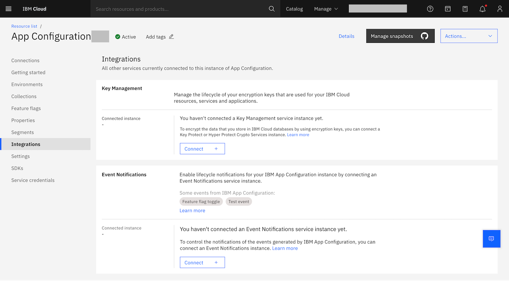

---

copyright:
  years: 2022
lastupdated: "2022-12-23"

keywords: app-configuration, app configuration, integrations, key protect, key management, hyper protect, hpcs

subcollection: app-configuration

---

{{site.data.keyword.attribute-definition-list}}

# Integrations
{: #ac-integrations}

Integrations in {{site.data.keyword.appconfig_short}} represent list of other {{site.data.keyword.cloud_notm}} services that are connected to your {{site.data.keyword.appconfig_short}} instance. You can encrypt the data that you store in {{site.data.keyword.cloud_notm}} databases by using encryption keys that you can control.
{: shortdesc}

The **Integrations** pane displays the integrations in the current {{site.data.keyword.appconfig_short}} service instance along with Name, type, location, and status of the integration.

{: caption="Figure 1. List of integrations" caption-side="bottom"}

You can use either one of the following options:
- Bring Your Own Key (BYOK) through {{site.data.keyword.keymanagementservicelong_notm}}, and use one of your own keys to encrypt your databases and backups.
- Hyper Protect Crypto Services (HPCS) - {{site.data.keyword.cloud}} {{site.data.keyword.hscrypto}}, a dedicated key management service, and Hardware Security Module (HSM) that provides you with the Keep Your Own Key capability for cloud data encryption with exclusive control of your encryption keys.

BYOK and KYOK capabilities are supported only for {{site.data.keyword.appconfig_short}} Enterprise plan.
{: important}

For more information, see [Managing encryption](/docs/app-configuration?topic=app-configuration-ac-managing-encryption).

## Integrating with a Key management service
{: #ac-int-key-management}

If you are using {{site.data.keyword.appconfig_short}} CLI or API to create integration with a key management service (KMS), ensure that you have enabled authorization to grant access between services before integrating with a KMS service. For more information, see [Using authorizations to grant access between services](#ac-using-auth-access-between-services).
{: important}

You can create and bring keys that are created by using {{site.data.keyword.keymanagementserviceshort}} or {{site.data.keyword.hscrypto}}. To get started, you need [{{site.data.keyword.keymanagementserviceshort}}](https://cloud.ibm.com/catalog/key-protect){: external} or [{{site.data.keyword.hscrypto}}](https://cloud.ibm.com/catalog/services/hyper-protect-crypto-services) provisioned on your {{site.data.keyword.cloud_notm}} account. For more information, see [provisioning a key protect instance](https://cloud.ibm.com/docs/key-protect?topic=key-protect-provision){: external} or see [provisioning a {{site.data.keyword.hscrypto}} instance](/docs/hs-crypto?topic=hs-crypto-get-started){: external}.

1. From your {{site.data.keyword.appconfig_short}} service instance dashboard, click **Integrations**. By default, the integrations display the list of other {{site.data.keyword.cloud_notm}} services that are connected to your {{site.data.keyword.appconfig_short}} instance.

1. From the **Connect** drop-down list, select **Key Management**. This displays the **Key Management** side panel.

   {: caption="Figure 2. Create KMS integration" caption-side="bottom"}

1. Select **Key Protect** or **Hyper Protect Crypto Services** from the **Service** drop-down list, as per your requirement.

1. For the **Instance**, select one of these options:
   - **Create a new instance** - to create a new instance of the selected service. This will take you to the respective provisioning page of the service selected.
   - **Choose existing instance** - select this option if you already have a {{site.data.keyword.keymanagementserviceshort}} or {{site.data.keyword.hscrypto}} instance. Select the **Service** instance and **Root key** from the drop-down list.

1. Click **Create** to apply the use of your {{site.data.keyword.keymanagementserviceshort}} or {{site.data.keyword.hscrypto}} instance's root key to encrypt the segment data stored by your {{site.data.keyword.appconfig_short}} instance.

The newly created **Key Management** information is listed in the **Integrations** dashboard.

The overflow menu consists of:
- `View` - helps you to view the details of the selected encryption service.

## Using authorizations to grant access between services
{: #ac-using-auth-access-between-services}

Use {{site.data.keyword.Bluemix}} Identity and Access Management (IAM) to create or remove an authorization that grants one service access to another service. Use authorization delegation to automatically create access policies that grant access to dependent services.

### Creating an authorization in the console
{: #ac-create-auth-console}

1. In the {{site.data.keyword.cloud_notm}} console, click **Manage** > **Access (IAM)**, and select **Authorizations**.

1. Click **Create**.

1. Select a source account.
   * If the source service that needs access to the target service is in this account, select **This account**.
   * If the source service that needs access to the target service is in a different account, select **Other account**. Then, enter the **Account ID** of the source account.

1. Select a **Source service** as **App Configuration**.

1. Specify whether you want the authorization to be for all resources or Resources based on selected attributes, If you selected Resources based on selected attributes, then specify the *Add attributes**: only source resource group or only source service instance.

1. Select a **Target service** as per your requirement (Key Protect or Hyper Protect Crypto Services).

1. For the target service, specify whether you want the authorization to be for all instances, only a specific instance in the account, or instances only in a certain resource group.

1. Select a role to assign access to the source service that accesses the target service.

1. Click **Authorize**.

### Creating an authorization by using the CLI
{: #ac-create-auth-cli}

To authorize a source service access a target service, run the `ibmcloud iam authorization-policy-create` command.

For more information about all of the parameters that are available for this command, see [ibmcloud iam authorization-policy-create](/docs/cli?topic=cli-ibmcloud_commands_iam#ibmcloud_iam_authorization_policy_create).
