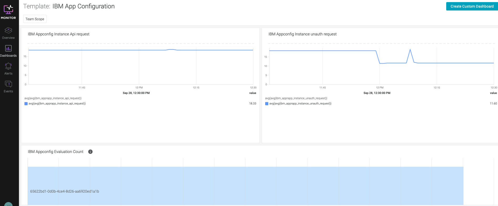

---

copyright:
  years: 2021, 2024
lastupdated: "2024-05-02"

keywords: app-configuration, app configuration, high availability, ha, monitoring, metrics, monitor apps

subcollection: app-configuration

---

{{site.data.keyword.attribute-definition-list}}

# Monitor {{site.data.keyword.appconfig_short}} service metrics with {{site.data.keyword.mon_full_notm}}
{: #ac-monitoring}

Use {{site.data.keyword.mon_full_notm}} to gain operational visibility into the performance and health of your applications, services, and platforms. It offers administrators, DevOps teams, and developers full stack telemetry with advanced features to monitor and troubleshoot, define alerts, and design custom dashboards.
{: shortdesc}

## Set up your {{site.data.keyword.mon_full_notm}} service instance
{: #setup-monitor}

To get started, you need to [provision IBM Cloud Monitoring](https://cloud.ibm.com/catalog/services/ibm-cloud-monitoring?callback=/observe/monitoring/create){: external} instance on your {{site.data.keyword.IBM}} account. For more information, see [Provisioning an instance](https://cloud.ibm.com/docs/monitoring?topic=monitoring-provision){: external}.

Currently, {{site.data.keyword.mon_full_notm}} integration is available for {{site.data.keyword.appconfig_short}} service deployments in the following regions:

| Deployment region | Monitoring region |
| -- | -- |
| Dallas | Dallas |
| Washington DC | Washington DC|
| London | London |
| Sydney | Sydney |
| Frankfurt | Frankfurt |
{: caption="Table 1. Deployment and monitoring regions" caption-side="bottom"}

Before you can start using {{site.data.keyword.appconfig_short}} monitoring metrics, you must first opt in and [enable platform metrics](https://cloud.ibm.com/docs/monitoring?topic=monitoring-platform_metrics_enabling){: external}.
{: note}

You can configure only one instance of the {{site.data.keyword.mon_full_notm}} service per region to collect platform metrics.
- To configure the {{site.data.keyword.mon_full_notm}} instance, you must turn on the platform metrics configuration setting.
- If a monitoring instance in a region is already enabled to collect platform metrics, metrics from enabled-monitoring services are collected automatically and available for monitoring through this instance. For more information about enabled-monitoring services, see {{site.data.keyword.cloud}} services.

To monitor platform metrics, check that the {{site.data.keyword.mon_full_notm}} instance is provisioned in the same region where the {{site.data.keyword.cloud_notm}} instance is provisioned.
{: note}

## Viewing metrics
{: #view-metrics}

To monitor {{site.data.keyword.appconfig_short}} metrics, you must launch the {{site.data.keyword.mon_full_notm}} web UI instance that is enabled for platform metrics in the region where your {{site.data.keyword.appconfig_short}} instance is available.
{: important}

### Launch {{site.data.keyword.mon_full_notm}} web UI from the {{site.data.keyword.appconfig_short}} dashboard
{: #access-metrics}

1. Log in to {{site.data.keyword.cloud_notm}}. The {{site.data.keyword.cloud_notm}} dashboard opens.

1. Click **View all** in the Resource summary section of the dashboard.

1. In the *Services* section, click the {{site.data.keyword.appconfig_short}} instance that you plan to monitor. The {{site.data.keyword.appconfig_short}} UI *Getting Started* page opens.

1. Click the **Actions** menu, and select **Monitoring**.

1. A new tab in your browser opens and displays the default dashboard that is named {{site.data.keyword.appconfig_notm}} within the context of your {{site.data.keyword.appconfig_short}} instance.

   {: caption="Figure 1. Set up monitoring" caption-side="bottom"}

## Access your {{site.data.keyword.mon_full_notm}} metrics
{: #access-monitor}

1. Launch the [{{site.data.keyword.mon_full_notm}} web UI](https://cloud.ibm.com/docs/monitoring?topic=monitoring-launch){: external} from the **Observability** page.

1. Click **DASHBOARDS**.

1. In the Default Dashboards section, expand IBM.

1. Choose the {{site.data.keyword.appconfig_short}} dashboard from the list.

   Access your deployment's monitoring dashboard from {{site.data.keyword.mon_full_notm}}, it's in the sidebar, under IBM.

   Next, change the scope or make a copy of the default dashboard to monitor an {{site.data.keyword.appconfig_short}} service instance.

   {: caption="Figure 2. IBM Cloud Monitoring dashboard" caption-side="bottom"}

## Metrics available by Service Plan
{: #metrics-by-plan}

{{site.data.keyword.appconfig_short}} supports three metrics that you can use to configure in your dashboard for monitoring. The table provides the details about the metrics.

| Metric Name | Enterprise   | Standard    | Basic | Lite   |
| ------------|--------------| -------------|--------| --------|
| [IBM Appconfig Instance API request](#ibm_apprapp_instance_api)| Yes | Yes |Yes | Yes |
| [IBM Appconfig Evaluation Count](#ibm_apprapp_instance_eval)| Yes | Yes |Yes | Yes |
| [IBM Appconfig Instance Unauth Request](#ibm_apprapp_instance_unauth)| Yes | Yes |Yes | Yes |
{: caption="Table 2. List of {{site.data.keyword.appconfig_short}} server, client, and admin SDKs" caption-side="bottom"}

### IBM Appconfig Instance API request
{: #ibm_apprapp_instance_api}

API request count per instance: Count of config API requests made from the SDK.

| Metadata | Description |
| -- | -- |
| `Metric Name` | `ibm_apprapp_instance_api_request` |
| `Metric Type` | `gauge`|
| `Value Type` | `none`|
| `Segment By` | `ibm_ctype`, `ibm_service_name`, `ibm_location`, `ibm_scope`, `ibm_service_instance`, `ibm_apprapp_instance_id` |
{: caption="Table 3. API request metadata" caption-side="bottom"}

### IBM Appconfig Evaluation Count
{: #ibm_apprapp_instance_eval}

Evaluation count per instance: Count of feature or property evaluations in the SDK.

| Metadata   | Description |
|-------------|-------------|
| `Metric Name` | `ibm_apprapp_instance_evaluation` |
| `Metric Type` | `gauge`|
| `Value Type` | `none`|
| `Segment By` | `ibm_ctype`, `ibm_service_name`, `ibm_location`, `ibm_scope`, `ibm_service_instance`, `ibm_apprapp_instance_id` |
{: caption="Table 4. Evaluation metadata" caption-side="bottom"}

### IBM Appconfig Instance unauth request
{: #ibm_apprapp_instance_unauth}

| Metadata   | Description |
|-------------|-------------|
| `Metric Name` | `ibm_apprapp_instance_unauth_request` |
| `Metric Type` | `gauge`|
| `Value Type` | `none`|
| `Segment By` | `ibm_ctype`, `ibm_service_name`, `ibm_location`, `ibm_scope`, `ibm_service_instance`, `ibm_apprapp_instance_id` |
{: caption="Table 5. Instance metadata" caption-side="bottom"}
