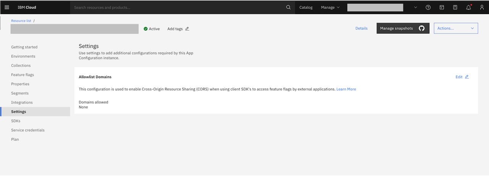
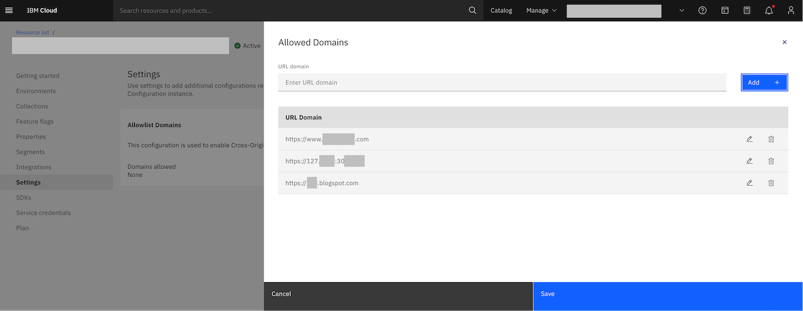

---

copyright:
  years: 2022, [{CURRENT_YEAR}]
lastupdated: "[{LAST_UPDATED_DATE}]"

keywords: app-configuration, app configuration, settings, cors, cross-origin resource sharing

subcollection: app-configuration

---

{{site.data.keyword.attribute-definition-list}}

# Adding domains to the allowlist
{: #ac-settings}

Use settings to add more configurations required by external applications to access {{site.data.keyword.appconfig_short}} resources. By default, the **Settings** page displays **Allowlist Domains**.
{: shortdesc}

## Allowlisting domains
{: #ac-cors}

The **Allowlist Domains** is used for enabling Cross-Origin Resource Sharing (CORS) when using client-side browser SDKs' to access {{site.data.keyword.appconfig_short}} resources by external applications. CORS is a specification, which enables controlled access to {{site.data.keyword.appconfig_short}} resources from resources that are located outside of a domain.

### Adding domains to allowlist
{: #ac-cors-allowlist}

To add domains to allowlist, complete these steps:

1. In the {{site.data.keyword.appconfig_short}} console, click **Settings**.

   {: caption="List of additional settings" caption-side="bottom"}

1. Click **Edit**. The side panel opens with fields for adding URLs to be allowlisted.

1. Enter the **URL** of the domain that needs to be added to **Allowlisted Domains** and click **Add +**. Repeat this step to add more URLs.

   {: caption="List of allowlisted domains" caption-side="bottom"}

1. Click **Save**.

You can also modify the **URL** of the domains by using the **Edit** option.

If you are using JavaScript or React SDK, you need to allowlist your domains using the above steps or using {{site.data.keyword.appconfig_short}} API. For more information, see [here](https://{DomainName}/apidocs/app-configuration#update-originconfigs){: external}.
{: note}
