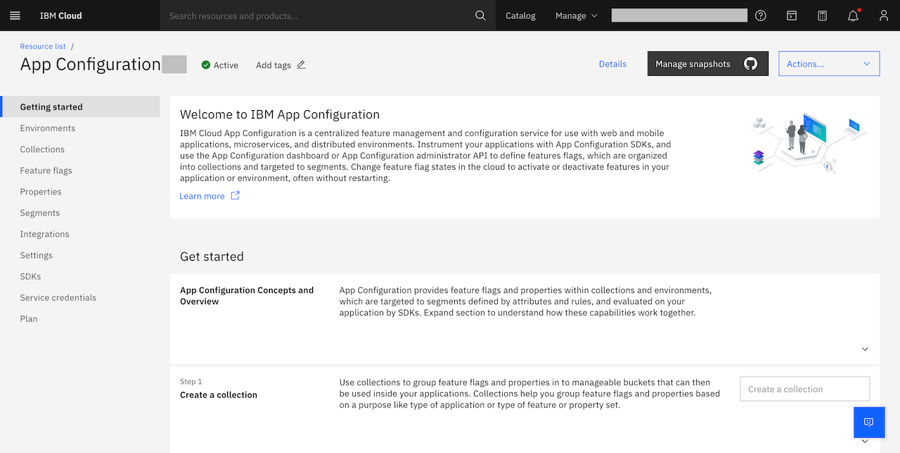
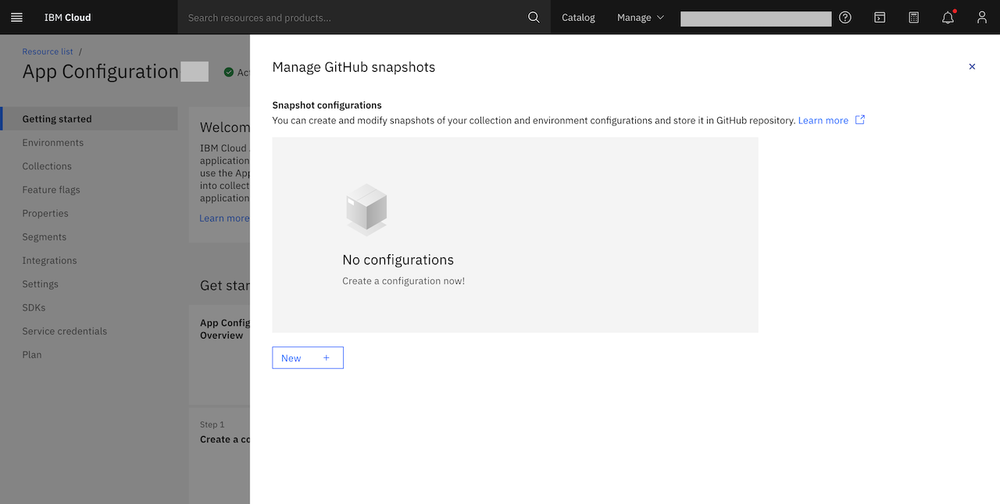
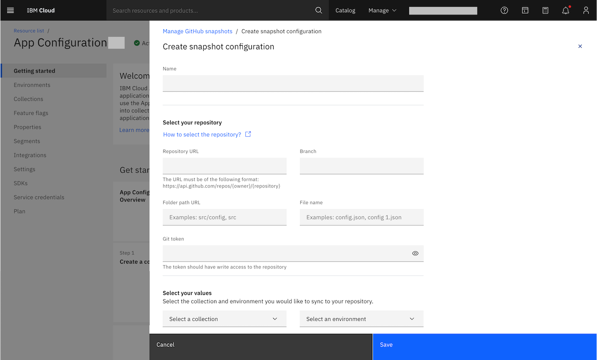
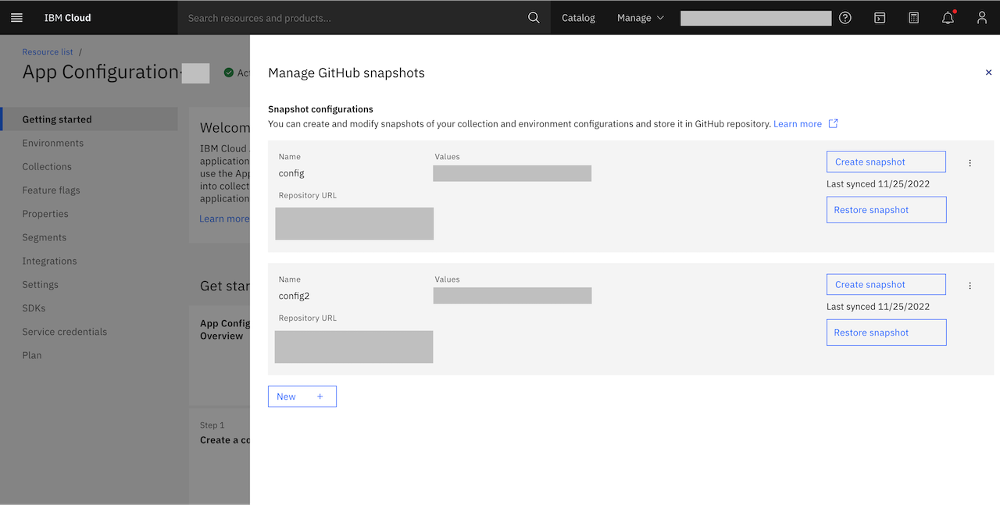

---

copyright:
  years: 2022
lastupdated: "2022-09-30"

keywords: app-configuration, app configuration, create a snapshot, snapshots, git configuration, gitops, git config

subcollection: app-configuration

---

{{site.data.keyword.attribute-definition-list}}

# Snapshots
{: #ac-snapshots}

Snapshots are a way to capture the current configuration of your app or environment and sync the modified config set back to your config git repo. This can help you in versioning, application bootstrapping, rollback, troubleshooting, or audit {{site.data.keyword.appconfig_short}}.
{: shortdesc}

Every snapshot configuration will have the collection and environment id associated with it, along with this user
can provide their GitHub details where they would like to promote their configurations.

By default, **Snapshots** displays the list of snapshot in the current {{site.data.keyword.appconfig_short}} service instance along with **Name**, **Collection_id** associated, **Environment_id** associated, **Git_branch**, **Git_url**, **Git_file_path**, **Git_token**, **last_sync_time** and the date of creation of the snapshot, and the latest date it was updated.
{: note}

## Configure a snapshot
{: #ac-create-a-snapshot}

To create a snapshot, complete these steps:

1. From the {{site.data.keyword.appconfig_short}} console, click **Manage Snapshots** from the top menu bar.

   {: caption="Figure 1. Manage snapshots in the current {{site.data.keyword.appconfig_short}} service instance" caption-side="bottom"}

1. Click **Manage Snapshots**. The side panel opens up where you will be seeing the **New +** button.

   {: caption="Figure 2. {{site.data.keyword.appconfig_short}} service creating a new snapshot" caption-side="bottom"}

1. Click the **New +** button. You will see the page where you need to provide the snapshot details.

   {: caption="Figure 3. {{site.data.keyword.appconfig_short}} service configuring a new snapshot" caption-side="bottom"}

   - **Name** - name of the snapshot.
   - **Collection ID** - the collection identifier, you can select the value from the dropdown menu.
   - **Environment ID** - the environment identifier, you can select the value from the dropdown menu.
   - **Repository URL** - specify the GitHub URL, for example if you want the configuration to be written to organisation GitHub account then here is the URL `https://api.github.{{org_name}}.com/repos/{{owner}}/{{repo_name}}` or if you want to write to your personal GitHub then the URL will be `https://api.github.com/repos/{{owner}}/{{repo_name}}`.
   - **Branch** - Add the branch name, to which you would like to write or update the config file.
   - **Folder path URL** - Provide the folder path to the file.
   - **File name** - provide the file name, we only allow `.json` or `.JSON` file extension.
   - **Git token** - provide the git token, this is the Personal access token this needs to be created with basic read, write and update permission. [How to create personal access token](https://docs.github.com/en/authentication/keeping-your-account-and-data-secure/creating-a-personal-access-token).

      Make sure you have selected the permissions as in Figure 4 when creating the **Git token**.
      {: note}

      {: caption="Figure 4. Permissions to be selected during Git token creation" caption-side="bottom"}

1. Click **Save**.

1. Once the snapshot is created, it will be listed in the **Manage snapshots** window.

   {: caption="Figure 5. {{site.data.keyword.appconfig_short}} service view configured snapshots" caption-side="bottom"}

## Create a GitHub snapshot
{: #ac-promote-a-snapshot}

To promote a snapshot, complete these steps:

1. First create the snapshot as suggested in the above steps.

1. Then you will see your configuration saved and displayed on the screen.

1. Click on the **Create snapshot**, if your configuration is correct then you will see the json file will be either updated if already exists, or it will be created if it does not exist.

   You can update the snapshot information using the API 'https://cloud.ibm.com/apidocs/app-configuration?code=go#update-gitconfig'.
   {: note}

## Snapshot - overflow menu
{: #snapshot-overflow-menu}

The overflow menu for each of the snapshot (three vertical dots) consist of **Delete** operation.

When **Delete** option is selected, a confirmation window is displayed to seek confirmation to delete the selected snapshot. Delete option permanently deletes the snapshot, this action cannot be undone.
{: note}
